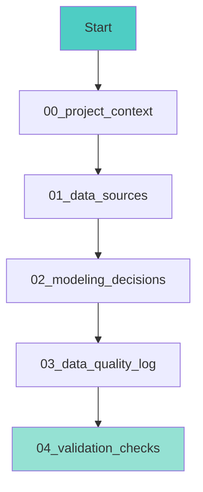
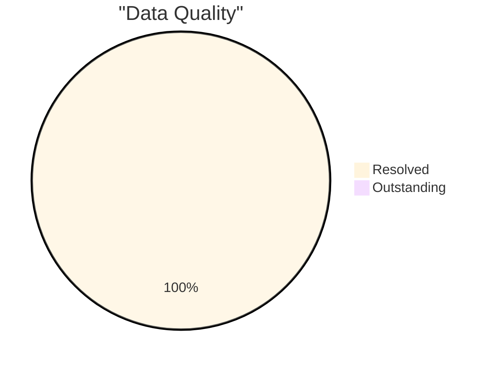

# 📚 Technical Documentation

**Project:** Hospital Medicare Spending Analysis  
**Focus:** Data Modeling with Real-World Quality Challenges

---

## 🎯 Purpose

Explains the **reasoning, structure, and quality controls** behind the data model.

Focus is not only on results, but on ***how* trustworthy results were achieved** from imperfect CMS data.

---

## 📊 Project Overview

Analyzes **Medicare Spending per Beneficiary (MSPB)** across 4 hospitals using public CMS datasets.

**Challenge:** Identifier format mismatch between source files prevented relationship creation.

**Workflow:**

---

## 📁 Documentation Files

**Reading order:**

| File | Purpose | Time |
|------|---------|------|
| **00_project_context.md** | What is MSPB and why it matters | 3 min |
| **01_data_sources.md** | CMS data files and challenges | 2 min |
| **02_modeling_decisions.md** | Star schema rationale | 4 min |
| **03_data_quality_log.md** | Issue resolution process | 5 min |
| **04_validation_checks.md** | Testing evidence | 3 min |

---

## 🔍 Key Highlights

### Challenge: Format Mismatch

**Problem:** Hospital file (TEXT) ❌ Spending file (INTEGER)  
**Solution:** Both files standardized to TEXT ✅  
**Result:** Relationship created successfully

**Documented in:** `03_data_quality_log.md`

### Design: Star Schema

**Chosen:** Star schema (simple, fast queries)  
**Not used:** Snowflake schema (unnecessary complexity)

**Documented in:** `02_modeling_decisions.md`

---

## ✅ Quality Metrics

| Metric | Value |
|--------|-------|
| Issues Identified | 3 |
| Issues Resolved | 3 (100%) |
| Validation Tests | 5 |
| Tests Passed | 5 (100%) |
| Data Completeness | 100% |

---

## 🎓 Professional Practices

| Practice Area | Demonstrated Skills |
|---------------|---------------------|
| **Quality Management** | Issue logging • Root cause analysis • Resolution |
| **Data Modeling** | Star schema • Dimensional design • Best practices |
| **Validation** | Test-driven • Quality gates • Documentation |

**Standards applied:**
- Dimensional modeling (Kimball)
- Data quality management
- Validation-driven development
- Professional documentation

---

## 🚀 Quick Start

1. **Context** → `00_project_context.md`
2. **Challenge** → `03_data_quality_log.md`
3. **Model** → `02_modeling_decisions.md`
4. **Validation** → `04_validation_checks.md`

---

**Document Owner:** Arthur Dorvil  
**Last Updated:** January 2026  
**Status:** ✅ Complete
