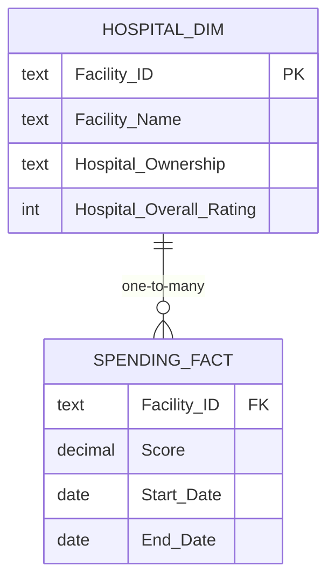
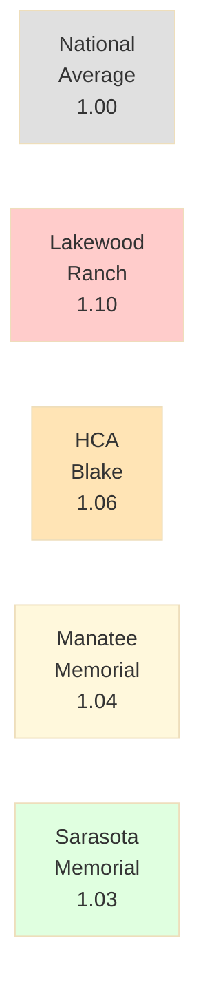
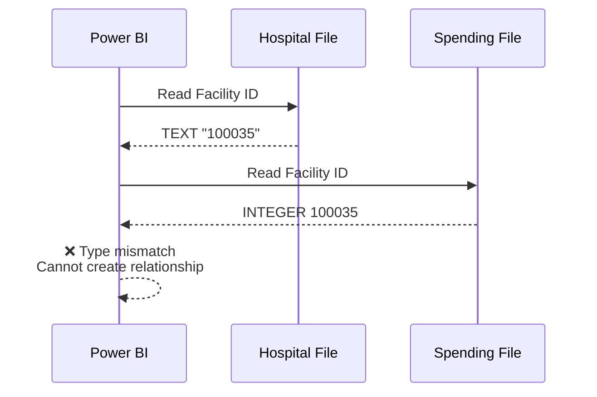
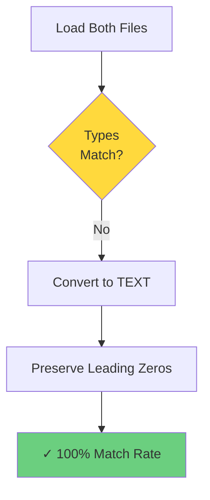
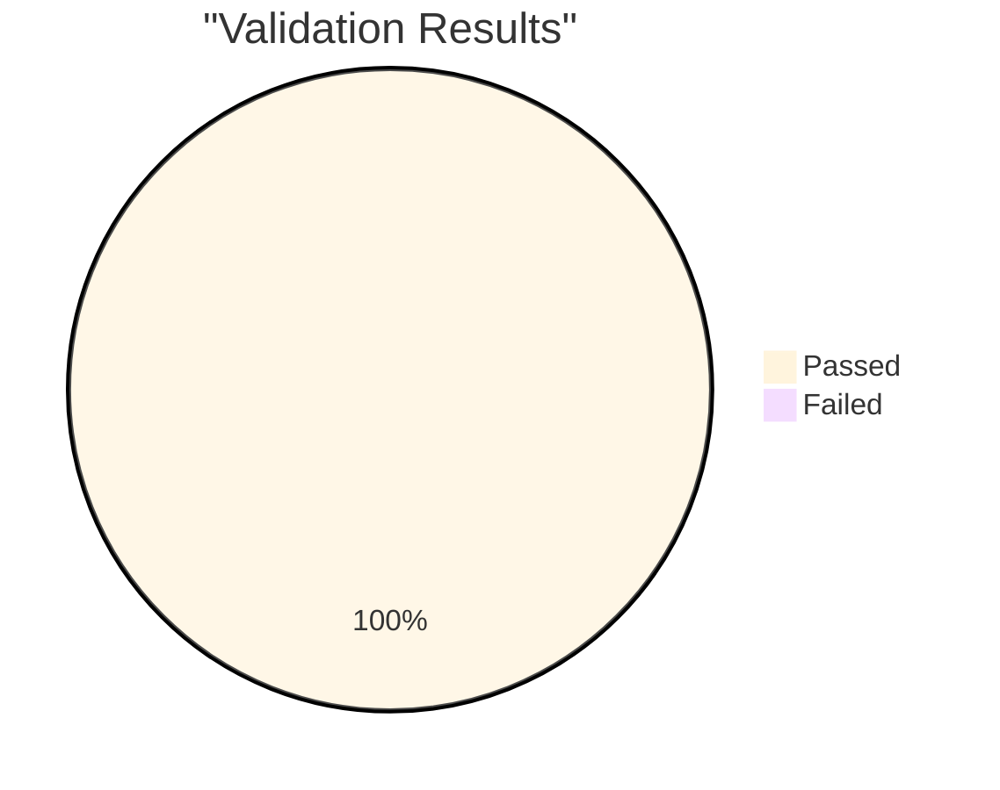

# 🏥 Hospital Medicare Spending Model

**A focused Power BI data modeling case study using real CMS Hospital Compare data**

[](https://powerbi.microsoft.com/)
[](https://data.cms.gov)

**Analyst:** Arthur Dorvil | **Date:** January 2026

---

## 🎯 Overview

Demonstrates professional **data integration and quality management** using actual CMS Hospital Compare data for 4 hospitals in Bradenton-Sarasota, Florida.

**Key Achievement:** Resolved critical Facility ID format mismatch between CMS source files.

---

## 📊 Dashboard


**Analysis Results:**

| Hospital | MSPB | vs National Avg |
|----------|------|-----------------|
| Lakewood Ranch Medical Center | **1.10** | +10% ⬆️ |
| HCA Florida Blake Hospital | 1.06 | +6% |
| Manatee Memorial Hospital | 1.04 | +4% |
| Sarasota Memorial Hospital | 1.03 | +3% |

**Finding:** All hospitals exceed national average Medicare spending (1.00).

---

## 🔧 Technical Challenge

### The Problem

CMS source files had incompatible Facility ID data types:

| File | Data Type | Example |
|------|-----------|---------|
| Hospital_General_Information.csv | TEXT | `"100035"` |
| Medicare_Hospital_Spending.csv | INTEGER | `100035` |

**Impact:** 0% match rate → relationship creation failed.

---

### The Solution


**Standardized both to TEXT in Power Query** → All 4 hospitals successfully joined.

---

## 🏗️ Data Model

**Star schema design:**



**Relationship Configuration:**
- **Key Column:** `Facility ID` (standardized TEXT in both tables)
- **Cardinality:** One-to-Many (1:*)
- **Direction:** Single (Hospital → Spending)
- **Status:** Active

---

## 📐 DAX Measures

```dax
Hospital Count = DISTINCTCOUNT(Hospital_Dim[Facility ID])

Avg Spending Score = AVERAGE(Spending_Fact[Score])

Max Spending Score = MAX(Spending_Fact[Score])

Data Completeness % = 
DIVIDE(
    CALCULATE([Hospital Count], NOT(ISBLANK(Spending_Fact[Score]))),
    [Hospital Count], 1
)
```

---

## ✅ Validation

**All tests passed:**

| Test | Status |
|------|--------|
| Relationship integrity (0 orphaned records) | ✅ |
| Cardinality (1:* enforced) | ✅ |
| Filter propagation (slicers working) | ✅ |
| Measure accuracy (all correct) | ✅ |
| Data completeness (100%) | ✅ |

**Result:** Model validated and production-ready.

---

## 📂 Repository Structure

```
Hospital-Spending-Model/
├── README.md                          ← You are here
├── LICENSE
├── Data/
│   ├── Hospital_General_Information.csv
│   └── Medicare_Hospital_Spending_Per_Patient-Hospital.csv
├── Documentation/
│   ├── readme.md                      ← Documentation guide
│   ├── 00_project_context.md         ← MSPB explained
│   ├── 01_data_sources.md            ← CMS data details
│   ├── 02_modeling_decisions.md      ← Star schema rationale
│   ├── 03_data_quality_log.md        ← Issue resolution
│   └── 04_validation_checks.md       ← Testing evidence
└── Power BI/
    ├── Thinking Demo.pbix             ← Data model + dashboard
    └── Thinking Demo.pdf              ← Dashboard export
```

---

## 🎯 Skills Demonstrated

**Technical Capabilities:**

| Category | Skills |
|----------|--------|
| **Data Integration** | Format standardization • Type conversion • Cross-system joins |
| **Data Modeling** | Star schema • Relationships • Cardinality |
| **Quality Assurance** | Issue resolution • Validation • Documentation |

**Technical:**
- Power Query transformations
- Dimensional modeling (star schema)
- DAX measure development
- Relationship configuration
- Data validation

**Professional:**
- Root cause analysis
- Systematic problem-solving
- Technical documentation
- Production thinking

---

## 🚀 Production Recommendations

| Current Approach | Production Approach |
|------------------|---------------------|
| Power Query fix | ETL pipeline (upstream) |
| Manual validation | Automated quality checks |
| In-memory model | DirectQuery/Composite |
| Full refresh | Incremental refresh |

---

## 📚 Documentation

Full technical documentation in `/Documentation`:

- **Project Context** - MSPB metric explained
- **Data Sources** - CMS file details and challenges
- **Modeling Decisions** - Star schema rationale
- **Data Quality Log** - Issue resolution process
- **Validation Checks** - Testing evidence

---

## 🎓 Why This Matters

This project shows the **technical foundation** that makes reliable analytics possible:

✓ Real-world data quality challenges  
✓ Systematic problem-solving  
✓ Professional documentation  
✓ Production-ready thinking

**Previous work** showed polished dashboards.  
**This project** shows the data modeling that makes them trustworthy.

---

**Data Source:** CMS Hospital Compare (public domain)  
**Period:** January 1, 2023 – December 31, 2023  
**Status:** ✅ Validated and production-ready
    B -->|Star Schema| C[Validated<br/>Model]
    
    style A fill:#ff6b6b,color:#fff
    style B fill:#4ecdc4
    style C fill:#95e1d3
```

**Key Achievement:** Resolved critical Facility ID format mismatch between CMS source files.

---

## 📊 Analysis Results

**Medicare Spending per Beneficiary (MSPB)** for 4 regional hospitals:



| Hospital | MSPB | vs National Avg |
|----------|------|-----------------|
| Lakewood Ranch Medical Center | **1.10** | +10% ⬆️ |
| HCA Florida Blake Hospital | 1.06 | +6% |
| Manatee Memorial Hospital | 1.04 | +4% |
| Sarasota Memorial Hospital | 1.03 | +3% |

**Finding:** All hospitals exceed national average Medicare spending.

---

## 🔧 Technical Challenge

### The Problem



**Source file incompatibility:**
- `Hospital_General_Information.csv` → TEXT with leading zeros
- `Medicare_Hospital_Spending_Per_Patient-Hospital.csv` → INTEGER without leading zeros

**Impact:** 0% match rate → relationship creation failed.

---

### The Solution

**Standardized both to TEXT in Power Query:**



**Result:** All 4 hospitals successfully joined via One-to-Many relationship.

---

## 🏗️ Data Model

**Star schema design:**


**Relationship Configuration:**
- **Key Column:** `Facility ID` (standardized TEXT in both tables)
- **Cardinality:** One-to-Many (1:*)
- **Direction:** Single (Hospital → Spending)
- **Status:** Active

---

## 📐 DAX Measures

```dax
Hospital Count = DISTINCTCOUNT(Hospital_Dim[Facility ID])

Avg Spending Score = AVERAGE(Spending_Fact[Score])

Max Spending Score = MAX(Spending_Fact[Score])

Data Completeness % = 
DIVIDE(
    CALCULATE([Hospital Count], NOT(ISBLANK(Spending_Fact[Score]))),
    [Hospital Count], 1
)
```

---

## ✅ Validation



**Confirmed:**
- ✅ Relationship integrity (0 orphaned records)
- ✅ Cardinality (1:* enforced)
- ✅ Filter propagation (slicers working)
- ✅ Measure accuracy (all correct)
- ✅ Data completeness (100%)

---

## 📂 Repository Structure

```
Hospital-Spending-Model/
├── README.md                          ← You are here
├── LICENSE
├── Data/
│   ├── Hospital_General_Information.csv
│   └── Medicare_Hospital_Spending_Per_Patient-Hospital.csv
├── Documentation/
│   ├── readme.md                      ← Documentation guide
│   ├── 00_project_context.md         ← MSPB explained
│   ├── 01_data_sources.md            ← CMS data details
│   ├── 02_modeling_decisions.md      ← Star schema rationale
│   ├── 03_data_quality_log.md        ← Issue resolution
│   └── 04_validation_checks.md       ← Testing evidence
└── Power BI/
    ├── Thinking Demo.pbix             ← Data model + dashboard
    └── Thinking Demo.pdf              ← Dashboard export
```

---

## 🎯 Skills Demonstrated

**Technical Capabilities:**

| Category | Skills |
|----------|--------|
| **Data Integration** | Format standardization • Type conversion • Cross-system joins |
| **Data Modeling** | Star schema • Relationships • Cardinality |
| **Quality Assurance** | Issue resolution • Validation • Documentation |

**Technical:**
- Power Query transformations
- Dimensional modeling (star schema)
- DAX measure development
- Relationship configuration
- Data validation

**Professional:**
- Root cause analysis
- Systematic problem-solving
- Technical documentation
- Production thinking

---

## 🚀 Production Recommendations

| Current Approach | Production Approach |
|------------------|---------------------|
| Power Query fix | ETL pipeline (upstream) |
| Manual validation | Automated quality checks |
| In-memory model | DirectQuery/Composite |
| Full refresh | Incremental refresh |

---

## 📚 Documentation

Full technical documentation in `/Documentation`:

- **Project Context** - MSPB metric explained
- **Data Sources** - CMS file details and challenges
- **Modeling Decisions** - Star schema rationale
- **Data Quality Log** - Issue resolution process
- **Validation Checks** - Testing evidence

---

## 🎓 Why This Matters

This project shows the **technical foundation** that makes reliable analytics possible:

✓ Real-world data quality challenges  
✓ Systematic problem-solving  
✓ Professional documentation  
✓ Production-ready thinking

**Previous work** showed polished dashboards.  
**This project** shows the data modeling that makes them trustworthy.

---

**Data Source:** CMS Hospital Compare (public domain)  
**Period:** January 1, 2023 – December 31, 2023  
**Status:** ✅ Validated and production-ready
